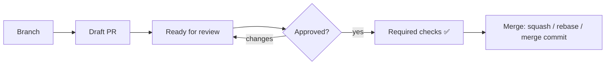

# GitHub Workshop 🚀

From "we have a repo" to "we have a real engineering platform"

<div class="pt-12">
  <span @click="$slidev.nav.next" class="px-2 py-1 rounded cursor-pointer hover:bg-white hover:bg-opacity-10">
    Press space for the next page <carbon:arrow-right class="inline"/>
  </span>
</div>

<div class="abs-br m-6 text-sm opacity-60">
  Shmuel Max · Marina Marenkov
</div>

---
layout: center
class: text-center
---

# Today's journey

3.5 hours · hands-on · YAML survives contact with reality

<div class="grid grid-cols-3 gap-4 pt-8 text-left">
  <div>
    <h3>① Collaboration</h3>
    PRs, branch protection, CODEOWNERS, gh CLI
  </div>
  <div>
    <h3>② Actions deep dive</h3>
    Workflows, matrix, reusable, security
  </div>
  <div>
    <h3>③ Operations</h3>
    Artifacts, debugging, re-runs
  </div>
</div>

---
layout: section
---

# Module 1
## GitHub Collaboration & CI Flow

---

# GitLab → GitHub — terminology cheat sheet

| GitLab | GitHub |
|--------|--------|
| Merge Request (MR) | Pull Request (PR) |
| Maintainer | Admin / Maintain |
| Protected branches | Branch protection rules / Rulesets |
| `.gitlab-ci.yml` | `.github/workflows/*.yml` |
| Runners | Runners (hosted or self-hosted) |
| Environments | Environments (with approvals!) |
| CI/CD Variables | Secrets & Variables (repo / env / org) |

<!--
Spend 2 minutes here. Most pain in migrations is mental: same concept,
different name, slightly different scope.
-->

---

# PR lifecycle



- **Draft PR** = "I'm working on this, look but don't approve"
- **CODEOWNERS** auto-requests reviewers
- **Required reviews + required checks** = the only thing that actually protects `main`

---

# Branch protection — the 5 rules that matter

1. ✅ **Require PR before merge** (no direct pushes)
2. ✅ **Require approvals** (1–2 typical, code owner approval for sensitive paths)
3. ✅ **Require status checks** (CI must be green)
4. ✅ **Require branches up to date** (catches "merged stale main")
5. ✅ **Restrict who can push** (only the bot/release manager)

> Bonus: **Require linear history** if you like clean `git log`. **Require signed commits** for compliance-heavy orgs.

---

# GitHub CLI — your daily driver

```bash
# Daily
gh pr create --fill --draft
gh pr checks --watch
gh pr review --approve

# Investigation
gh pr list --search "review:required author:@me"
gh run list --workflow=ci.yml --limit 5
gh run view <run-id> --log-failed

# Power moves
gh pr checkout 1234
gh workflow run deploy.yml -f environment=staging
gh release create v1.2.0 --generate-notes
```

<!--
Live demo here. Don't read the slide — show it.
-->

---
layout: section
---

# Module 2
## GitHub Actions Deep Dive

---

# The mental model

```yaml
name: CI
on: [push, pull_request]    # 🎯 Trigger

jobs:                       # 🧱 Jobs run in parallel by default
  test:
    runs-on: ubuntu-latest  # 🖥️  Runner
    steps:                  # 📋 Steps run sequentially
      - uses: actions/checkout@v4
      - uses: actions/setup-node@v4
        with:
          node-version: 20
      - run: npm ci
      - run: npm test
```

- **Workflow** = file. **Job** = unit of scheduling. **Step** = command or `uses:`.
- Jobs are **isolated** (fresh VM). Use `needs:` to chain them.

---

# Triggers — the ones you'll actually use

```yaml
on:
  push:
    branches: [main]
    paths: ['src/**', '.github/workflows/**']
  pull_request:
    types: [opened, synchronize, reopened]
  workflow_dispatch:           # 👈 manual button
    inputs:
      environment:
        type: choice
        options: [staging, production]
  schedule:
    - cron: '0 6 * * 1'        # Mondays 06:00 UTC
  workflow_call:               # 👈 reusable workflow
```

---

# Matrix builds — test everywhere, in parallel

```yaml
strategy:
  fail-fast: false
  matrix:
    os: [ubuntu-latest, windows-latest, macos-latest]
    node: [18, 20, 22]
    exclude:
      - { os: windows-latest, node: 18 }
    include:
      - { os: ubuntu-latest, node: 22, experimental: true }
runs-on: ${{ matrix.os }}
steps:
  - uses: actions/setup-node@v4
    with: { node-version: '${{ matrix.node }}' }
  - run: npm test
```

3 OS × 3 Node = 9 jobs in parallel (minus excludes, plus includes). Cost: minutes of YAML.

---

# Caching — make it fast, keep it cheap

```yaml
- uses: actions/setup-node@v4
  with:
    node-version: 20
    cache: 'npm'              # built-in, easiest

# Or full control:
- uses: actions/cache@v4
  with:
    path: ~/.npm
    key: ${{ runner.os }}-node-${{ hashFiles('**/package-lock.json') }}
    restore-keys: ${{ runner.os }}-node-
```

Rule of thumb: **cache lock-file derived stuff**, never node_modules itself across major version bumps.

---

# Reusable workflows — DRY for pipelines

```yaml
# .github/workflows/deploy.yml — the callee
on:
  workflow_call:
    inputs:
      environment: { type: string, required: true }
    secrets:
      DEPLOY_TOKEN: { required: true }
jobs:
  deploy:
    runs-on: ubuntu-latest
    steps:
      - run: echo "Deploying to ${{ inputs.environment }}"
```

```yaml
# Caller
jobs:
  staging:
    uses: ./.github/workflows/deploy.yml
    with:  { environment: staging }
    secrets: inherit
```

---

# Secrets, variables, environments

| What | Where | Use case |
|------|-------|----------|
| `secrets.*` | Repo / Env / Org | API tokens, passwords |
| `vars.*` | Repo / Env / Org | Non-sensitive config (region, feature flag) |
| `env:` | Workflow / Job / Step | Local overrides |
| **Environments** | Repo settings | Group secrets + **add approvals** |

> 🔒 Secrets are **not** passed to workflows triggered from forks. Plan for it.

---

# Environments + approvals = production safety

```yaml
jobs:
  deploy-prod:
    needs: deploy-staging
    environment:
      name: production
      url: https://app.example.com
    steps:
      - run: ./deploy.sh
```

In repo settings → Environments → `production`:
- 👤 Required reviewers
- ⏱️  Wait timer
- 🌿 Deploy from `main` only

**Result:** the job pauses, sends a notification, and waits for a human to click ✅.

---

# Security — least privilege, by default

```yaml
permissions: {}                # 👈 deny everything

jobs:
  build:
    permissions:
      contents: read           # 👈 grant only what's needed
      pull-requests: write
    steps:
      - uses: actions/checkout@a1b2c3d4...   # 👈 SHA pin 3rd-party actions
```

- **Pin third-party actions to a SHA**, not a tag (tags are mutable)
- **Use OIDC** instead of long-lived cloud credentials (`id-token: write`)
- **Don't** echo secrets — they're masked, but logs leak in attachments

---
layout: section
---

# Module 3
## Operations & Debugging

---

# Artifacts — passing files between jobs

```yaml
- uses: actions/upload-artifact@v4
  with:
    name: build-output
    path: dist/
    retention-days: 7

# In a downstream job:
- uses: actions/download-artifact@v4
  with: { name: build-output, path: dist/ }
```

- Artifacts are **per-run**, kept for retention period (max 90 days)
- For cross-run sharing → use **caches** or a registry

---

# Debugging — when CI is red and you're not

1. **Re-run failed jobs** — flaky? Sometimes that's the answer
2. **Re-run with debug logging** — `ACTIONS_RUNNER_DEBUG=true`, `ACTIONS_STEP_DEBUG=true`
3. **`tmate` action** for SSH-into-runner (use sparingly, public repos beware)
4. **`$GITHUB_STEP_SUMMARY`** — write Markdown summaries from your scripts

```bash
echo "### 🧪 Test Results" >> $GITHUB_STEP_SUMMARY
echo "| Suite | Passed |" >> $GITHUB_STEP_SUMMARY
echo "|-------|--------|" >> $GITHUB_STEP_SUMMARY
echo "| unit  | ✅ 142 |" >> $GITHUB_STEP_SUMMARY
```

---
layout: center
class: text-center
---

# What you should leave with

✅ A green CI workflow you wrote yourself
✅ A release pipeline triggered by `workflow_dispatch`
✅ Branch protection enforcing reviews + checks
✅ The reflex to type `gh` instead of opening a tab

---
layout: end
---

# Thank you 🙏

[github.com/ShmuelMax100/github-workshop](https://github.com/ShmuelMax100/github-workshop)

Questions, issues, PRs welcome.
